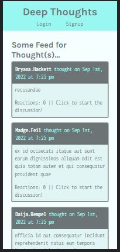
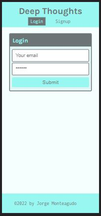
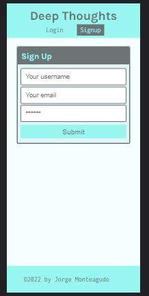
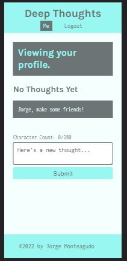

# deep-thougts

## Table of Contents

1. [Description](#description)
2. [Installation](#installation)
3. [Usage](#usage)
4. [License](#license)
5. [Contributions](#how-to-contribute)
6. [Contact Me](#contact)

## Description

Social Media Application where users can create an account, post their thoughts for others to see, and interact with other users through thoughts and reactions. Created in React, this app is a SPA.

USER STORY

- As a user, I can retrieve data about users, their thoughts, reactions, and friends from the server
- As a user, I can create my own account and login
- As a logged in user, I can create thoughts, react to thoughts, and add friends
- As a user, I can see every user's thoughts listed on the homepage of the application
- As a user, I can navigate directly to a user's profile page with their thoughts and friends list

- As a user, I can navigate directly to a single thought's page to view reactions to that thought
- As a user, I can create an account and login to the application through the front end
- As a user, I can create a thought, create a reaction to a thought, and add a friend through the front end of the application

Technologies used:
Mongo DB
Graph QL
React
Apollo Server Graph QL
JWT

## Installation

Download code, and run scripts detailed in package.json to install dependencies, seed database and start the servers.

## Usage

Users that are not logged in can view thoughts through the homepage, but cannot interact, add reactions or post their own thoughts. Users can sign up or log in by clicking the appropriate links in the navigation component
Once logged in, users can view their profile, where information about their friendlist and thoughts are displayed. Users can add thoughts, add reactions, and add friends.

FEATURES:
Users can log in/sign up and be authenticated via JWT.
Users can see posts without logging in, but will be prompted to login page if they try to interact witht he posts
Users can view their posts on thier profile page, as well as edit/delete posts they choose
Users can add other users as friends, making it easier to see their posts and interact with them

## License

Distributed under **ISC**. See [License](https://spdx.org/licenses/ISC.html) for more information.

ISC License

Permission to use, copy, modify, and/or distribute this software for any purpose with or without fee is hereby granted, provided that the above copyright notice and this permission notice appear in all copies.

THE SOFTWARE IS PROVIDED "AS IS" AND THE AUTHOR DISCLAIMS ALL WARRANTIES WITH REGARD TO THIS SOFTWARE INCLUDING ALL IMPLIED WARRANTIES OF MERCHANTABILITY AND FITNESS. IN NO EVENT SHALL THE AUTHOR BE LIABLE FOR ANY SPECIAL, DIRECT, INDIRECT, OR CONSEQUENTIAL DAMAGES OR ANY DAMAGES WHATSOEVER RESULTING FROM LOSS OF USE, DATA OR PROFITS, WHETHER IN AN ACTION OF CONTRACT, NEGLIGENCE OR OTHER TORTIOUS ACTION, ARISING OUT OF OR IN CONNECTION WITH THE USE OR PERFORMANCE OF THIS SOFTWARE.

## Badges

## How to Contribute

To contribute to this application, make sure to fork the repository and clone it to your computer. Email me with any questions or any ideas about possible contributions. Then create a pull request for your code to be reviewed before being merged to the application.

## Tests

No test provided.

## Contact

For any questions, concerns, or ideas for contributions, email me or contact me via gitHub.

**GitHub Profile:** <https://github.com/jorge30fm>

**GitHub Repository:** <https://github.com/jorge30fm/deep-thoughts>
**Deployed App:** <https://hidden-anchorage-50418.herokuapp.com/>

**Email:** jorge30fm@gmail.com
